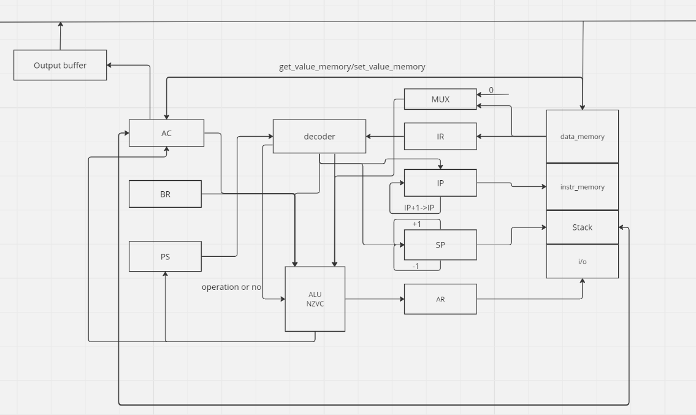

# lab3
* Е Хэн P33111
* asm | acc | harv | hw | instr | struct | stream | mem | cstr | prob5 | pipeline

## Языки программирования
* The language itself is case insensitive. For example ld #1 is equal to LD #1
* The first function is necessarily _start, which is the input.
* Everything after ";" is considered a comment on the line
* Empty lines are ignored; the number of spaces at the beginning and end of the line is not important.
* Status values:
  * N = 1
  * Z = 2
  * V = 4
  * C = 8
* Direct: if the argument is just some number, then it is considered an address. That is, ld 29 - this means loading the value into the 30th cell into the accumulator
* Just a value: if the argument has a '#' and is followed by a single number, then the argument is considered a value. That is, ld #29 is to load 29 into the battery
* Variables: If the argument is a variable that is defined in the data section, then it considers the address of the variable.
* Character: encoded into a number using the symbol table. For example, ld 'A' = ld #27
* The code is executed sequentially. Operations:
  - `ld` -- Load a value from memory into a register

  - `st` -- Store a value from register into memory

  - `add` -- add the specified value to the register

  - `sub` -- subtract the specified value from the register

  - `mul` -- multiply the register value by the specified

  - `div` -- divide the register value by the specified value

  - `cmp` -- compare the register value with the specified one and set the status value

  - `jmp` -- unconditional jump to the specified location in the program

  - `jz` -- jump if only bit Z = 0

  - `js` -- - transition if the register value is less than the specified value

  - `jnz` -- jump if not only bit Z = 0

  - `hlt` -- breakpoint
  
  - `call` -- call a function
  
  - `ret` -- exit the function
  
  - `inv` -- get the inverse number of the register.


* Backus-Naur Form
``` ebnf
program ::= { line }

line ::= label [ comment ] "\n"
       | instr [ comment ] "\n"
       | [ comment ] "\n"

label ::= label_name ":"

instr ::= op0
        | op1 label_name

op0 ::= "ld"
      | "st"
      | "add"
      | "sub"
      | "mul"
      | "div"
      | "cmp"
      | "call"
      | "hlt"
      | "ret"
      | "inv"

op1 ::= "jmp"
      | "jz"
      | "js"
      | "jnz"
      

integer ::= [ "-" ] { <any of "0-9"> }-

label_name ::= <any of "a-z A-Z _"> { <any of "a-z A-Z 0-9 _"> }

comment ::= ";" <any symbols except "\n">
```

* Characters are stored in memory as a number:

```

' ':0, 'a':1, 'b':2, 'c':3, 'd':4, 'e':5, 'f':6, 'g':7, 'h':8, 'i':9, 'j':10,
'k':11, 'l':12, 'm':13, 'n':14, 'o':15, 'p':16, 'q':17, 'r':18, 's':19, 't':20, 'u':21,'v':22, 'w':23, 'x':24, 'y':25, 'z':26, 'A':27, 'B':28, 'C':29, 'D':30, 'E':31, 'F':32,'G':33, 'H':34, 'I':35, 'J':36, 'K':37, 'L':38, 'M':39, 'N':40, 'O':41, 'P':42, 'Q':43,'R':44, 'S':45, 'T':46, 'U':47, 'V':48, 'W':49, 'X':50, 'Y':51, 'Z':52, '':53, '0':54,'1':55, '2':56, '3':57, '4':58, '5':59, '6':60, '7':61, '8':62, '9':63, '!':64, ',':65,'.':66, '-':67, '*':68, '?':69, '+':70, '/':71, '@':72, '\0':73, '\n':74

```

## Организация памяти
* There is one command and data memory.(data_memory, instr_memory)
* Memory is a list that consists of cells. The cell is implemented by the Cell class. The cell stores
* Machine word - 32 bit, signed. One cell only stores one character. The symbol is also a number according to the char table, which is defined in ISA
Or an instruction, which is represented as a class - Instruction. In a class object, instruction stores the instruction type and argument


## Система команд
* * Machine word - 32 bit, signed. One cell only stores one character. The symbol is also a number according to the char table, which is defined in ISA
* Or an instruction, which is represented as a class - Instruction. In a class object, instruction stores the instruction type and argument
* Architecture: Harvard Architecture
* Registers:
  * IP - Stores the address of the next instruction to be executed
  * AC
    * accumulator
    * saves the result of any function
    * stores the result of any mathematical operation 
  * BR - Save intermediate data during the operation
  * PS - NZVC
  * AR - indicating the address of the cell with which the register is interacting
### Набор инструкции

| Syntax | Кол-во тактов | comment                                                                                                                    |
|--------|---------------|----------------------------------------------------------------------------------------------------------------------------|
| ld     | 3             | загрузить значение в аккумулятор из памяти                                                                                 |
| st     | 3             | выгрузить значение из аккумулятора в память                                                                                |
| add    | 3             | прибавить к значению аккумулятора указанное                                                                                |
| sub    | 3             | вычесть из значения аккумулятора указанное                                                                                 |
| div    | 3             | поделить значение аккумулятора на указанное                                                                                |
| inv    | 4             | нет адресации. Получить обратное значение                                                                                  |
| mul    | 3             | помножить значение аккумулятора на указанное                                                                               |
| cmp    | 3             | сравнить значение  аккумулятора  с указанным и поставить значение состояния                                                |
| jmp    | 2             | нет адресации. Безусловный переход в указанное место в программе                                                           |
| js     | 3             | переход в случае, если значение аккумулятора меньше чем значение указанное. Количество тактов зависит от наличии перехода. |
| jnz    | 3             | переход в случае, если не только бит Z = 0. Количество тактов зависит от наличии перехода.                                 |
| jz     | 3             | переход в случае, если только бит Z = 0. Количество тактов зависит от наличии перехода.                                    |
| call   | 8             | вызвать функцию                                                                                                            |
| ret    | 7             | выйти из функции                                                                                                           |
| hlt    | 2             | точка останова. Количество тактов - это для чтения инструкции.                                                             |

**2 такта для чтения инструкции из памяти**

## Кодирование инструкций
* The whole program is divided into 3 parts. We divide it by the ':' symbol:
* The first part is just instruments. Consists of three parts.
  * First column is the instruction index
  * Second column - instructions
  * Third column - argument (if any)
* The second part is functions. We divide it by the ':' symbol.
  * First column - name
  * Second column - instruction index
* The third part is the mark. We divide it by the ':' symbol:
  * The first column is the function name
  * Second column - label name
  * Third column - instruction index
* The fourth part is variables. We divide it by the ':' symbol:
  * First column is the variable name
  * Second column - value
  * third column is the length of the line (if exist)
Пример:
```
0 LD 'H' 
1 ST OUTPUT 
2 LD 'e' 
3 ST OUTPUT 
4 LD 'l' 
5 ST OUTPUT 
6 LD 'l' 
7 ST OUTPUT 
8 LD 'o' 
9 ST OUTPUT 
10 LD ',' 
11 ST OUTPUT 
12 LD 'w' 
13 ST OUTPUT 
14 LD 'o' 
15 ST OUTPUT 
16 LD 'r' 
17 ST OUTPUT 
18 LD 'l' 
19 ST OUTPUT 
20 LD 'd' 
21 ST OUTPUT 
22 HLT 
FUNCTION
_START:0
LABEL
_START:.LOOP:0
VARIABLE
```

## Транслятор
* command line: translator.py <input_file> <target_file>"
* Implemented in module: translator
* Allows you to support basic debug
* Этапы трансляции (функция translate):
  * If the string is a label, then saves its place, including its function and name in the label_in_fun dictionary.
  * If the string is a function, then saves its place and name in the function_point dictionary
  * If the string is an instruction, then stores its location, type, and argument into the string result
  * When reading a line, automatically ignores the comment
  * Generate an output file based on result, variable, label_in_fun and function_point.

## Модель процессора
* Implemented in [machine.py](./machine.py ) Command line: machine.py <target_file> <inputfile>". If without input, then inputfile = "".
* Beat(Hardwired):
  * Operations on one object are not performed in one clock cycle.
  * Operations on different objects are performed in one clock cycle.
* DataPath
  * Implemented in the DataPath class.

## Тестирование
Implemented programs
* hello world: display the string 'Hello World!'
* cat: cat program, repeat input on output.
* prob2
* prob5
Integration tests are implemented here test_translator.py:

## Апробация

| ФИО    | алг   | Loc  | code байт | code инстр. | инстру. | вариант |
|--------| ----- | ---- | --------- | ----------- |---------| ------- |
| Е Хэн  | prob5 | 47   | 1 KB      | 47          | 365     | asm     |
| Е Хэн  | cat   | 11   | 1 KB      | 11          | 159     | asm     |
| Е Хэн  | hello | 27   | 1 KB      | 27          | 23      | asm     |
| Е Хэн  | prob2 | 29   | 1 KB      | 29          | 465     | asm     |